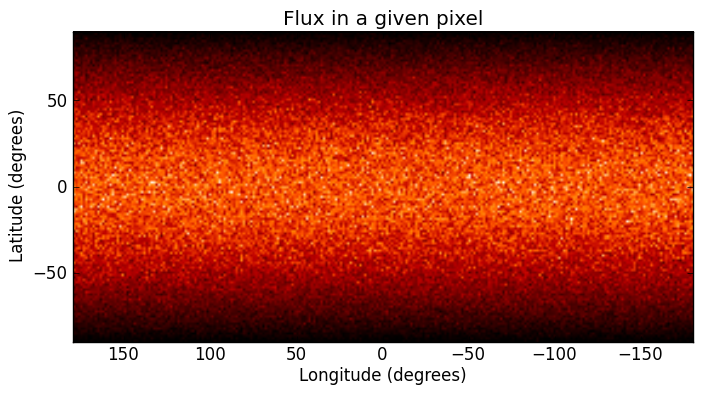
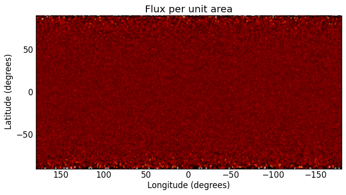

How to set the luminosity for an external radiation field
=========================================================

Two source types, :class:`~hyperion.sources.ExternalSphericalSource` and :class:`~hyperion.sources.ExternalBoxSource` are available, and can be used to simulate an external radiation field (such as the interstellar radiation field). One of the tricky parameters to set is the luminosity, because one often knows what the mean intensity of the interstellar radiation field should be, but not the total luminosity emitted from a spherical or box surface.

From empirical tests, we find that if one wants a particular value of :math:`J` (the mean intensity integrated over frequency), then the luminosity should be set to :math:`A\pi J` where :math:`A` is the area of the external source. We can check this with a specific example. `Mathis, Mezger, and Panagia (1983) <http://adsabs.harvard.edu/abs/1983A%26A...128..212M>`_ find

.. math:: 4\pi J=0.0217\,{\rm erg\,cm^{-2}\,s^{-1}}

We now set up a model with a spherical grid extending to 1pc in radius, with an external spherical source that has a 6000K blackbody spectrum (the shape of the spectrum is not important for our test here, only the luminosity)::

    import numpy as np

    from hyperion.model import Model
    from hyperion.util.constants import pc

    m = Model()

    m.set_spherical_polar_grid([0., 1.001 * pc],
                               [0., np.pi],
                               [0., 2. * np.pi])

    s = m.add_external_spherical_source()
    s.radius = pc
    s.temperature = 6000.

    # A = 4 * pi * pc * pc
    # pi * J = 0.0217 / 4
    s.luminosity = np.pi * pc * pc * 0.0217

    sed = m.add_peeled_images(sed=False, image=True)
    sed.set_inside_observer((0., 0., 0.))
    sed.set_image_limits(180., -180., -90., 90.)
    sed.set_image_size(256, 128)
    sed.set_wavelength_range(100, 0.01, 100.)

    m.set_raytracing(True)

    m.set_n_initial_iterations(0)
    m.set_n_photons(imaging=0,
                    raytracing_sources=1000000,
                    raytracing_dust=0)

    m.write('test_mmp83.rtin')
    m.run('test_mmp83.rtout')

We have set up an observer inside the grid to make an all-sky map from 0.01 to
100 microns. Once the model has run, we can now extract the image, make a plot at 1 micron, and find the total luminosity integrated over the sky (:math:`4\pi J`) which should be equal to the value we put in::

    import numpy as np
    import matplotlib.pyplot as plt

    from hyperion.model import ModelOutput
    from hyperion.util.constants import c
    from hyperion.util.integrate import integrate_loglog

    m = ModelOutput('test_mmp83.rtout')

    wav, fnu = m.get_image(units='ergs/cm^2/s/Hz', inclination=0)
    nu = c / (wav * 1.e-4)

    # Find wavelength closest to 1 micron
    iwav = np.argmin(abs(wav - 1.))

    fig = plt.figure()
    ax = fig.add_subplot(1, 1, 1)
    ax.imshow(fnu[:,:,iwav], cmap=plt.cm.gist_heat, extent=[180., -180., -90., 90.])
    ax.set_xlabel("Longitude (degrees)")
    ax.set_ylabel("Latitude (degrees)")
    ax.set_title("Flux in a given pixel")
    fig.savefig('all_sky_map.png', bbox_inches='tight')

    # Sum all pixels in image to make an all-sky SED
    fnu_sed = fnu.sum(axis=1).sum(axis=0)

    # Find total flux integrated over frequency in ergs/s/cm^2
    fnu_tot = integrate_loglog(nu, fnu_sed)

    print "4 * pi * J = %.5f" % fnu_tot

with the output::

    4 * pi * J = 0.02164

which is what we put in (modulo an imprecision due to the finite number of
pixels and wavelength bins). The all-sky image looks like:

Note that the darkening at high and low latitudes is due to the pixels getting
smaller. We can do the same but extracting the image in MJy/sr so that the flux is now per unit area so that we will not see these darkening effects::

    import numpy as np
    import matplotlib.pyplot as plt

    from hyperion.model import ModelOutput
    from hyperion.util.constants import c
    from hyperion.util.integrate import integrate_loglog

    m = ModelOutput('test_mmp83.rtout')

    wav, fnu = m.get_image(units='MJy/sr')
    nu = c / (wav * 1.e-4)

    # Find wavelength closest to 1 micron
    iwav = np.argmin(abs(wav - 1.))

    fig = plt.figure()
    ax = fig.add_subplot(1, 1, 1)
    ax.imshow(fnu[0,:,:,iwav], cmap=plt.cm.gist_heat, extent=[180., -180., -90., 90.], vmin=0., vmax=1.)
    ax.set_xlabel("Longitude (degrees)")
    ax.set_ylabel("Latitude (degrees)")
    ax.set_title("Flux per unit area")
    fig.savefig('all_sky_map_per_area.png', bbox_inches='tight')

    # Average all pixels in image to make an all-sky SED (use average not sum,
    # since flux is per unit area)
    fnu_sed = fnu[0,:,:,:].mean(axis=1).mean(axis=0)

    # Now have fnu_sed in MJy/sr, convert to ergs/cm^2/s/sr
    fnu_sed *= 1.e-17

    # Convert to ergs/cm^2/s
    fnu_sed *= 4 * np.pi

    # Find total flux integrated over frequency in ergs/s/cm^2
    fnu_tot = integrate_loglog(nu, fnu_sed)

    print "4 * pi * J = %.5f" % fnu_tot

with the output::

    4 * pi * J = 0.02160

which is, as before, what we put in. The all-sky image now looks like:

The flux is uniform over the image. The noise goes up at the edges because the
pixels are smaller and therefore catch fewer photons.
