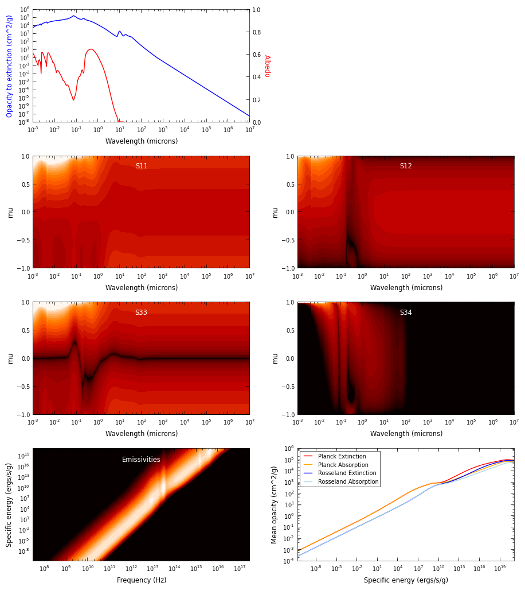
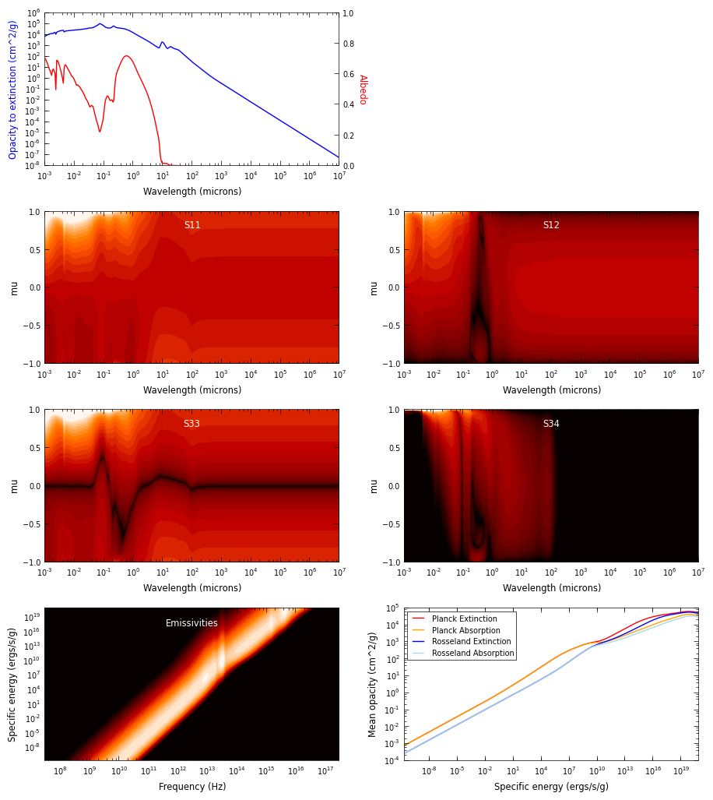

Draine et al. (2003) Milky-Way dust
===================================

These dust properties are for the carbonaceous-silicate grain model developed
by `Bruce Draine`_ and collaborators. The three dust models are those for the
Milky Way size distribution for Rv=3.1, 4.0, and 5.5, and the abundances and
grain size distribution are taken from `Weingartner and Draine (2001)`_.

.. note:: The dust properties given here are given per unit mass of **dust**,
          and do not include the gas mass. This means that when using Hyperion,
          the dust densities should be specified, not the total densities.

The Rv=3.1, 4.0, and 5.5 models are those with b_c=60ppm,
40ppm, and 30ppm respectively. The renormalization of the dust-to-gas ratio
mentioned in `Draine (2003)`_ is not important here, since we give the dust
properties per unit dust mass.

The dust properties presented here were recomputed with the code described in
:doc:`bhmie`, and may differ slightly from those given by `Bruce Draine`_ (we
had to recompute them in order to obtain the full scattering properties which
were otherwise not available).

The dust files are available in the ``hyperion-dust`` directory as
``dust_files/d03_3.1_6.0_A.hdf5``, ``dust_files/d03_4.0_4.0_A.hdf5``, and
``dust_files/d03_5.5_3.0_A.hdf5`` (once you have run
``python setup.py build_dust``), where the first number indicates the Rv, and
the second indicates b_c.

Milky-Way dust, Rv=3.1, b_c=6.0 (``dust_files/d03_3.1_6.0_A.hdf5``)
-------------------------------------------------------------------

The following plot gives an overview of the dust properties (as described in
:doc:`../setup/setup_dust`):

    
Milky-Way dust, Rv=4.0, b_c=4.0 (``dust_files/d03_4.0_4.0_A.hdf5``)
-------------------------------------------------------------------

The following plot gives an overview of the dust properties (as described in
:doc:`../setup/setup_dust`):

    
Milky-Way dust, Rv=5.5, b_c=3.0 (``dust_files/d03_5.5_3.0_A.hdf5``)
-------------------------------------------------------------------

The following plot gives an overview of the dust properties (as described in
:doc:`../setup/setup_dust`):

.. _Draine (2003): http://adsabs.harvard.edu/abs/2003ARA%26A..41..241D
.. _Bruce Draine: http://www.astro.princeton.edu/~draine/dust/dustmix.html 
.. _Weingartner and Draine (2001): http://adsabs.harvard.edu/abs/2001ApJ...548..296W
