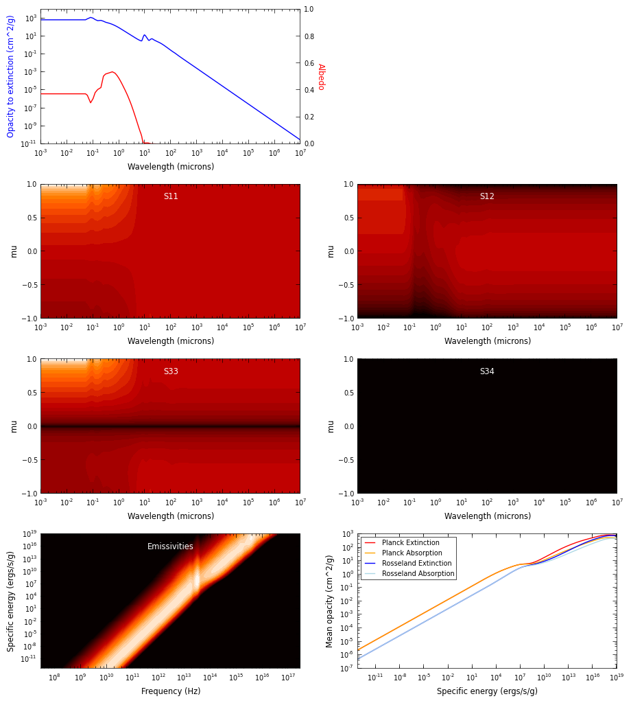

Kim, Martin, and Hendry (1994) dust with Henyey-Greenstein scattering
=====================================================================

These are dust properties from `Kim, Martin, and Hendry (1994)`_, also known as
KMH. The dust consists of astronomical silicates, graphite, and carbon and the
size distribution was determined using a maximum entropy method. This dust type
is meant to be applicable to the diffuse ISM (for low column densities) in the
Galaxy.

.. note:: The dust properties given here are given per unit mass of
          **gas+dust**, assuming a gas-to-dust ratio of 141.84. This means that
          when using Hyperion, the total gas+dust densities should be specified.

This version of the dust file is take directly from `HOCHUNK`_, the radiative
transfer code developed by B. Whitney et al. This is the dust you should use if
you want to reproduce results from that code, and it approximates the
scattering with a Henyey-Greenstein function. However, if you are interested in
the best version of the KMH dust, with full scattering properties, you can find
this under :doc:`kmh`.

The dust file is available in the ``hyperion-dust`` directory as
``dust_files/kmh94_3.1_hg.hdf5`` (once you have run
``python setup.py build_dust``).

Rv=3.1 (``dust_files/kmh94_3.1_hg.hdf5``)
-------------------------------------------

The following plot gives an overview of the dust properties (as described in
:doc:`../setup/setup_dust`):

.. _Kim, Martin, and Hendry (1994): http://dx.doi.org/10.1086/173714

.. _HOCHUNK: http://gemelli.colorado.edu/~bwhitney/codes/codes.html