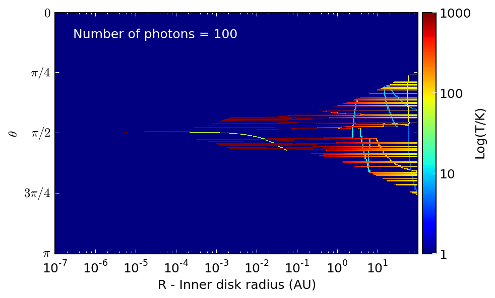
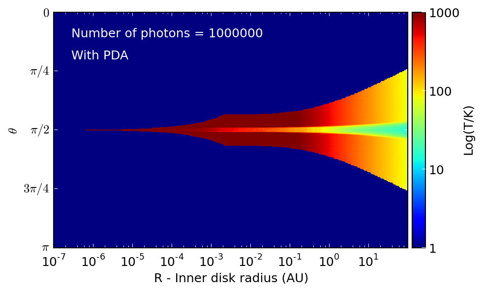

Choosing the number of photons wisely
=====================================

.. note:: This section is incomplete at this time, and only covers choosing
          the photon numbers for the specific energy/temperature calculation.

As described in :doc:`../setup/setup_conf` and
:doc:`../advanced/advanced_conf`, the number of photons should be set with
the::

    m.set_n_photons(...)

method. The arguments to specify depend on the type of calculation

Specific Energy/Temperature
---------------------------

The number of photons used in the initial specific energy calculation is set
with the ``initial=`` keyword argument. A good starting value for this if
the density grid is close to optically thin is to set it to be at least the
number of cells in the grid. If the optical depth is much larger, e.g. in
the case of protoplanetary disks, one may need to choose 10 or 100 times the
number of cells in order to get a good signal-to-noise.

The best way to check whether an adequate value has been chosen is to
extract the specific energy or temperature grids as described in
:doc:`../postprocessing/extracting_quantities`, and to visualize these.
The following image shows an example of the specific energy in an
azimuthally symmetric cylindrical grid (i.e. showing z vs r) where the
initial number of photons is too low. Individual photon propagation paths
can be seen, and the temperature map is very poorly defined.

If the temperature is increased, then the temperature map becomes smoother,
though in the densest regions, the temperature is still very noisy:

Once it is not possible to realistically increase the number of photons
without running into computational limitations, one can instead resort to
using the PDA approximation (described in :ref:`diffusion`) to compute the
missing temperature values in the most optically thick regions.

