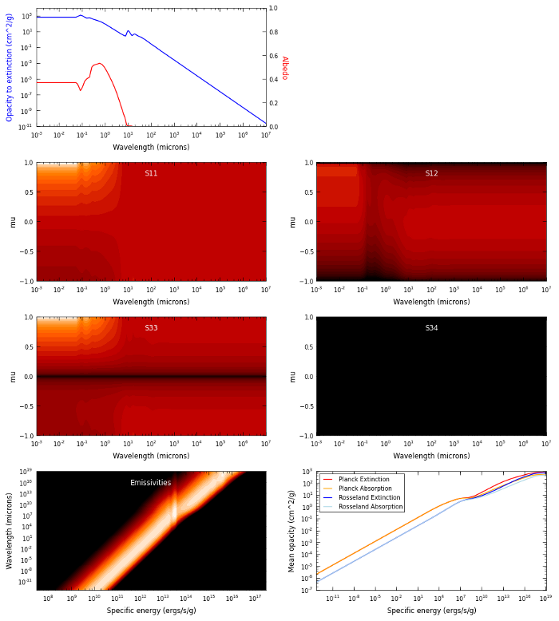

Preparing dust properties
=========================

Arguably one of the most important inputs to the model are the dust
properties. At this time, Hyperion supports anisotropic wavelength-dependent
scattering of randomly oriented grains, using a 4-element Mueller matrix
(Chandrasekhar 1960; Code & Whitney 1995). See Section 2.1.3 of `Robitaille
(2011)
<http://www.aanda.org/index.php?option=com_article&access=doi&doi=10.1051/0004-6361/201117150&Itemid=129>`_
for more details.

.. note:: Because the choice of a dust model is very important for the model,
          no 'default' dust models are provided with Hyperion, as there is no
          single sensible default. Instead, you can set up any dust model
          using the instructions below. In future, a database of published and
          common dust models will be provided. If you are not sure which dust
          model to use, or are not familiar with opacities, albedos, and
          scattering phase functions, you are strongly encouraged to team up
          with someone who is an expert on the topic of dust, as this should
          not be left to chance!

There are several ways to set up the dust properties that you want to use, and
these are detailed in sections below. In all cases, setting up the dust models
is done by first creating an instance of a specific dust class, then setting
the properties, and optionally writing out the dust properties to a file::

    from hyperion.dust import SphericalDust
    d = SphericalDust()
    < set dust properties here >
    d.write('mydust.hdf5')

.. note:: Carefully look at the warnings that are raised when writing the dust
          file, as these may indicate issues that will have an impact on the
          radiative transfer. See `Common warnings`_ for more details.

It is also possible to plot the dust properties::

    d.plot('mydust.png')

which gives a plot that can be used to get an overview of all the dust
properties:

Important note on units
-----------------------

In all of the following sections, quantities should be specified in the cgs
system of units (e.g. :math:`cm^2/g` for the opacities). Whether the opacities
are specified per unit mass of dust or gas is not important, as long as the
densities specified when setting up the geometry are consistent. For example,
if the opacities are specified per unit dust mass, the densities specified
when setting up the model should be dust densities.

Dust with isotropic scattering
------------------------------

Creating a dust object with isotropic scattering properties is very simple.
First, import the ``IsotropicDust`` class::

   from hyperion.dust import IsotropicDust

and create and instance of the class by specifying the frequency, albedo, and
opacity to extinction (absorption + scattering)::

    d = IsotropicDust(nu, albedo, chi)

where ``nu``, ``albedo``, and ``chi`` should be specified as lists or 1-d
Numpy arrays, and ``nu`` should be monotonically increasing. The ``albedo``
values should all be in the range 0 to 1, and the ``chi`` values should be
positive. The scattering matrix elements will be set to give isotropic
scattering, and the emissivities and mean opacities will be set assuming local
thermodynamic equilibrium.

Dust with Henyey-Greenstein scattering
--------------------------------------

Creating a dust object with Henyey-Greenstein scattering properties is very
similar to isotropic scattering, with the exception that the scattering
parameters have to be specified. The scattering is anisotropic, and the phase
function is defined by analytical functions (`Henyey & Greenstein, 1941
<http://dx.doi.org/10.1086/144246>`_).

First, import the ``HenyeyGreensteinDust`` class::

   from hyperion.dust import HenyeyGreensteinDust

and create an instance of the class by specifying the frequency, albedo,
opacity to extinction (absorption + scattering), and the anisotropy factor and
the maximum polarization::

    d = HenyeyGreensteinDust(nu, albedo, chi, g, p_lin_max)

where ``nu``, ``albedo``, ``chi``, ``g`` and ``p_lin_max`` should be specified
as lists or 1-d Numpy arrays, and ``nu`` should be monotonically increasing.
The ``albedo`` values should all be in the range 0 to 1, and the ``chi``
values should be positive. The scattering matrix elements will be set to give
the correct phase function for the scattering properties specified, and the
emissivities and mean opacities will be set assuming local thermodynamic
equilibrium.

Fully customized 4-element dust
-------------------------------

While the Henyey-Greenstein scattering phase function allows for anisotropic
scattering, it approximates the phase function by analytical equations. In
some cases, it is desirable to instead use the full numerical phase function
which can be arbitrarily complex.

To set up a fully customized 4-element dust model, first import the
``SphericalDust`` class (this actually refers to any kind of dust that would
produce a 4-element scattering matrix, including randomly oriented
non-spherical grains)::

   from hyperion.dust import SphericalDust

Then create an instance of this class::

   d = SphericalDust()

Now that you have a dust 'object', you will need to set the optical properties
of the dust, which include the albedo and extinction coefficient (in cgs) as a
function of frequency (in Hz)::

    d.optical_properties.nu = nu
    d.optical_properties.albedo = albedo
    d.optical_properties.chi = chi

where ``nu``, ``albedo``, and ``chi`` should be specified as lists or 1-d
Numpy arrays, and ``nu`` should be monotonically increasing. The ``albedo``
values should all be in the range 0 to 1, and the ``chi`` values should be
positive.

Once these basic properties are set, you will need to set the scattering
properties by setting the matrix elements. These should be specified as a
function of the cosine of the scattering angle, ``mu``. The values of ``mu``
should be specified as a 1-d Numpy array::

    d.optical_properties.mu = mu

Once ``nu`` and ``mu`` are set, the values of the scattering matrix elements
can be set. These are stored in variables named using the convention of Code &
Whitney (1995): P1 (equivalent to S11), P2 (equivalent to S12), P3 (equivalent
to S44), and P4 (equivalent to -S34). Each of these variables should be
specified as a 2-d array with dimensions ``(n_nu, n_mu)``, where ``n_nu`` is
the number of frequencies, and ``n_mu`` is the number of values of the cosine
of the scattering angle::

    d.optical_properties.P1 = P1
    d.optical_properties.P2 = P2
    d.optical_properties.P3 = P3
    d.optical_properties.P4 = P4

Alternatively, it is possible to call::

    d.optical_properties.initialize_scattering_matrix()

After which ``P1``, ``P2``, ``P3``, and ``P4`` will be set to arrays with the
right dimensions, and with all values set to zero. You could for example set
up an isotropic scattering matrix by setting the values of the arrays::

    d.optical_properties.P1[:, :] = 1.
    d.optical_properties.P2[:, :] = 0.
    d.optical_properties.P3[:, :] = 1.
    d.optical_properties.P4[:, :] = 0.

If nothing else is specified, the dust emissivity will be set assuming local
thermodynamic equilibrium (i.e. it will be set to the opacity to absorption
times Planck functions).

Emissivities
------------

By default, emissivities and mean opacities will be calculated under the
assumption of local thermodynamic equilibrium for 1200 dust temperatures
between 0.1 and 100000K, but this can be customized, as described below.

LTE emissivities
^^^^^^^^^^^^^^^^

To set the LTE emissivities manually, you can call the
``set_lte_emissivities`` method. For example, to calculate the emissivities
for 1000 temperatures between 0.1 and 2000K, you can do::

    d.set_lte_emissivities(n_temp=1000,
                           temp_min=0.1,
                           temp_max=2000.)

The more temperatures the emissivities are calculated for, the more accurate
the radiative transfer (Hyperion interpolates between emissivities,
rather the picking the closest one) but the slower the dust file will be to
generate and read into Hyperion.

Custom emissivities
^^^^^^^^^^^^^^^^^^^

If you want to specify fully customized emissivities as a function of specific
energy, you can instead do this by directly accessing the variables, which are
stored as attributes to ``d.emissivities``, i.e.::

    d.emissivities.nu
    d.emissivities.var
    d.emissivities.jnu
    d.emissivities.var_name

The attribute ``nu`` should be set to a 1-d array giving the frequencies that
the emissivities are specified for, ``var`` should be set to another 1-d array
containing the values of the specific energy the emissivities are defined for,
and ``jnu`` should be set to a 2-d array with dimensions ``(len(nu),
len(var))`` giving the emissivities. In addition, you will need to set
``var_name`` to ``'specific_energy'`` (in future, other kinds of emissivity
variables may be supported). For example, to set a constant emissivity as a
function of frequency and specific energy, you can do::

    d.emissivities.nu = np.logspace(8., 16., 100)  # 100 values between 10^8 and 10^16
    d.emissivities.var = np.logspace(-2., 8., 20)  # 20 values of the specific energy
                                                   # between 10^-2 and 10^8
    d.emissivities.jnu = np.ones(100, 20)  # constant emissivities
    d.emissivities.var_name = 'specific_energy'

Extrapolating optical properties
--------------------------------

In some cases (see e.g. `Common warnings`_) it can be necessary to extrapolate
the dust properties to shorter and/or longer wavelengths. While it would be
preferable to do this extrapolation properly before passing the values to the
dust objects, in some cases the extrapolation is relatively straightforward,
and you can make use of the following extrapolation convenience functions::

    d.optical_properties.extrapolate_wav(0.1, 1000)
    d.optical_properties.extrapolate_nu(1.e5, 1.e15)

In the first case, the extrapolation is done by specifying wavelengths in
microns, and in the second case by specifying the frequency (in Hz).

The extrapolation is done in the following way:

* The opacity to extinction (``chi``) is extrapolated by fitting a
  power-law to the opacities at the two highest frequencies and
  following that power law, and similarly at the lowest
  frequencies. This ensures that the slope of the opacity remains
  constant.

* The albedo is extrapolated by assuming that the albedo is constant outside
  the original range, and is set to the same value as the values for the
  lowest and highest frequencies.

* The scattering matrix is extrapolated similarly to the albedo, by simply
  extending the values for the lowest and highest frequencies to the new
  frequency range.

The plots shown higher up on this page have made use of these extrapolation
methods.

Common warnings
---------------

One of the most common warnings when computing the LTE emissivities or writing out a dust file is the following::

   WARNING: Planck function for lowest temperature not completely covered by opacity function
   WARNING: Planck function for highest temperature not completely covered by opacity function

The LTE emissivity is set to :math:`\kappa_\nu B_\nu(T)`, so you need to
ensure that the opacity is defined over a frequency large enough to allow this
to be calculated from the lowest to the highest temperatures used for the LTE
emissivities. The default range is quite large (0.1 to 100000K) so you can
either reduce this range (see `LTE emissivities`_) or you should define the
optical properties over a larger frequency range (see `Extrapolating optical
properties`_ for one way to do this).

More specifically, the frequency range should extend almost three orders of
magnitude above the peak frequency for the coldest temperature, and one order
of magnitude below the peak frequency for the hottest temperature. For the
default temperature range for the LTE emissivities (0.1 to 100000K), this
means going from about 5e7 to 5e16Hz (or 0.5nm to 5m) which is a huge
frequency range, over which dust properties are often not known. However, in
most cases, a sensible extrapolation of the properties you have should be fine
- the plots shown higher up on this page show the values extrapolated to the
required range. If you restrict yourself to a smaller temperature range (e.g.
3 to 1600K) you can also reduce the required range significantly.

.. note:: If you do not fix this warning, the normalization of the
          emissivities will be off, and the results from the radiative
          transfer may be incorrect!

Writing dust files without the Python library
---------------------------------------------

If for any reason you wish to write the HDF5 dust files directly without using
the Hyperion Python library, you can find a detailed description of the format
in :doc:`../advanced/dust_file`.