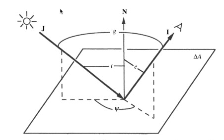

Scattering surfaces
===================

General notes
-------------

Given an arbitrarily fine grid, one should in theory be able to represent any
scattering surface by using very high densities. However, in most cases, it is
likely to be easier to simply specify a scattering surface using a geometrical
shape (e.g. a sphere) with a given scattering function. Hyperion includes
support for this.

Similarly to sources, surfaces are added using methods of the form
``m.add_*_surface``. For example, adding a spherical surface can be done with::

    surface = m.add_spherical_surface()
    
These methods return a surface 'object' that can be used to set and modify the
parameters of the surface::

    surface = m.add_spherical_surface()
    surface.radius = rsun
    etc.
    
In addition to geometrical parameters, all surfaces require a set of
scattering properties, which is stored in the ``surface_properties``
attribute::

    surface.surface_properties = ...
    
This should be set either to a filename containing the properties, or a
:class:`~hyperion.surfaces.SurfaceScatteringProperties` object. For
more details on setting up this object, see `Surface Properties`_.
      
Spherical Surfaces
------------------

In addition to the ``surface_properties`` attribute, spherical surfaces are
defined by a 3-d cartesian position and a radius::

    # Set up a spherical scattering surface at the position of the Earth in a
    # coordinate system centered on the Sun
    earth = m.add_spherical_surface()
    earth.radius = 637100000.  # cm
    earth.position = [au, 0., 0.]
    earth.surface_properties = ...
   
Surface Properties
------------------

The main quantity that needs to be specified is the bidirectional reflectance
distribution function (BRDF; `Wikipedia
<http://en.wikipedia.org/wiki/Bidirectional_reflectance_distribution_function>`_).
We use the notation from the book *Theory of Reflectance and Emittance
Spectroscopy* by Hapke (2012):

   
In this definition, an incident ray :math:`J` comes in at an angle :math:`i`
from the normal to the surface :math:`N`, and scatters into ray :math:`I`
which has an angle to the normal of :math:`e`, and where the incident and
scattered planes are rotated by an angle :math:`\psi`. Rather than express the
BRDF in terms of i and e, it is convenient to express it as a function of
:math:`\mu_0 = \cos{i}` and :math:`\mu = \cos{e}` (where the notations are
also consistent with Hapke 2012).

The BRDF gives the probability of scattering as a function of :math:`\mu_0`,
:math:`\mu`, and :math:`\psi`. In addition, since we are interested in
multi-wavelength radiative transfer, we want to express the BRDF as a function
of frequency :math:`\nu`.

To specify these properties in Hyperion, you will need to first create an
instance of the
:class:`~hyperion.surfaces.SurfaceScatteringProperties` class::

    from hyperion.surfaces import SurfaceScatteringProperties
    properties = SurfaceScatteringProperties()
    
then set the ``nu``, ``mu0``, ``mu``, and ``psi`` attributes to lists or
arrays which give the values at which you define the BRDF e.g.::

    properties.nu = np.logspace(5., 17., 10)
    properties.mu0 = np.linspace(0., 1., 5)
    properties.mu = np.linspace(0., 1., 5)
    properties.psi = np.linspace(0., 2*pi, 10)
    
The `nu` values should be given in Hz, the ``mu0`` and ``mu`` values should be
given as values between 0 and 1, and ``psi`` should be given in radians.

Once these attributes are set, you should set the BRDF by passing a
4-dimensional Numpy array with dimensions ``(n_nu, n_mu0, n_mu, n_psi)`` to the
``brdf`` attribute::

    properties.brdf = np.array(...)

Finally, you should set the albedo of the surface via the ``albedo``
attribute. This should be set to a list of a Numpy array with the same length
as ``nu``. If the albedo is less than 1 at any frequency, then when
scattering, a fraction of photons given by ``1 - albedo`` are terminated
rather than scattered.

It is possible to write the surface scattering properties to an HDF5 file, as
for dust, e.g.::

    properties.write('hapke_function.hdf5')
    
and to then specify the filename when setting up a surface, e.g.::

    surface.surface_properties = 'hapke_function.hdf5'

