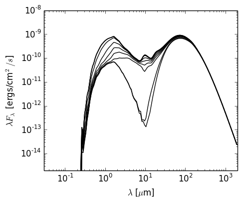

Typical Analytical YSO Model
============================

The following example model sets up the Class I model from `Whitney et al
(2003) <http://adsabs.harvard.edu/abs/2003ApJ...598.1079W>`_ For now, this
model does not include the accretion luminosity, but this will be added in the
future. First, we set up the model using the
:class:`~hyperion.model.AnalyticalYSOModel` class:

.. literalinclude:: scripts/class1_example_setup.py
   :language: python

.. note:: If you want to run this model you will need to download
          the :download:`kmh_lite.hdf5 <scripts/kmh_lite.hdf5>` dust file into the
          same directory as the script above (**disclaimer**: do not use this
          dust file outside of these tutorials!). You will also need the
          stellar photosphere model from :download:`here
          <scripts/kt04000g+3.5z-2.0.ascii>`.

The model takes a few minutes to run on 12 processes (a little less than an hour in serial mode). We can then proceed for example to plotting the SED:

.. literalinclude:: scripts/class1_example_plot.py
   :language: python

which gives:

which is almost identical to the bottom left panel of Figure 3a of `Whitney et
al (2003) <http://adsabs.harvard.edu/abs/2003ApJ...598.1079W>`_ (the
differences being due to slightly different dust properties).
