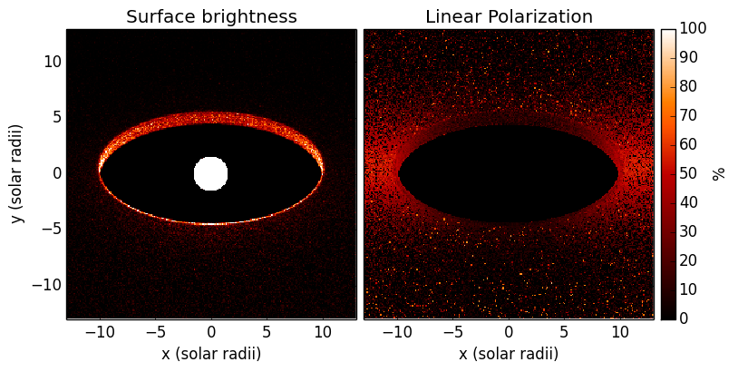

How to efficiently compute pure scattering models
=================================================

In some cases, for example if the wavelength is short enough, it is possible to
ignore dust emission when computing images. In such cases, we can make Hyperion
run faster by disabling the temperature calculation as described in
:ref:`pure-scattering`, and also by producing images only at select wavelengths
using :ref:`monochromatic-rt`. The following model demonstrates how to make an
image of the central region of a flared disk in order to image the inner rim:

.. literalinclude:: scripts/pure_scattering_setup.py
   :language: python

.. note:: If you want to run this model you will need to download
          the :download:`kmh_lite.hdf5 <scripts/kmh_lite.hdf5>` dust file into the
          same directory as the script above (**disclaimer**: do not use this
          dust file outside of these tutorials!).

Once this model has run, we can make a plot of the image (including a linear
polarization map):

.. literalinclude:: scripts/pure_scattering_plot.py
   :language: python

which gives:

   
This model takes under 4 minutes to run on 8 cores, which is less than would
normally be required to produce an image with this signal-to-noise in scattered
light.
   

