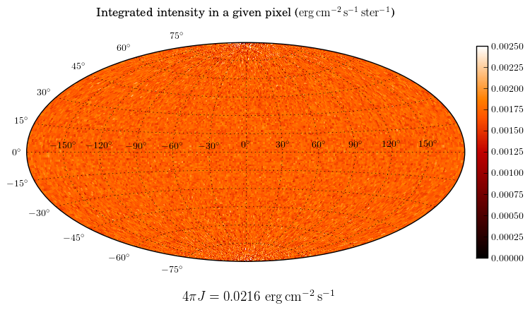

How to set the luminosity for an external radiation field
=========================================================

Two source types, :class:`~hyperion.sources.ExternalSphericalSource` and
:class:`~hyperion.sources.ExternalBoxSource` are available, and can be used to
simulate an external radiation field (such as the interstellar radiation field
or I). One of the tricky parameters to set is the luminosity, because one often
knows what the mean intensity of the interstellar radiation field should be,
but not the total luminosity emitted from a spherical or box surface.

From empirical tests, we find that if one wants a particular value of :math:`J`
(the mean intensity integrated over frequency), then the luminosity should be
set to :math:`A\pi J` where :math:`A` is the area of the external source. We
can check this using, as an example, the ISRF model from `Mathis, Mezger, and
Panagia (hereafter MMP; 1983)
<http://adsabs.harvard.edu/abs/1983A%26A...128..212M>`_, who find

.. math:: 4\pi J=0.0217\,{\rm erg\,cm^{-2}\,s^{-1}}

in the solar neighborhood.

We now set up a model with a spherical grid extending to 1pc in radius, with
the spectrum given by MMP83:

.. literalinclude:: scripts/setup_example_isrf.py
   :language: python

To run this model, you will need the :download:`mmp83.txt <scripts/mmp83.txt>`
file which contains the spectrum of the interstellar radiation field. We have
set up an observer inside the grid to make an all-sky integrated intensity map:

.. literalinclude:: scripts/extract_example_isrf.py
   :language: python

which gives:

As we can see, the value for :math:`4\pi J` is almost identical to the value we
initially used above.
