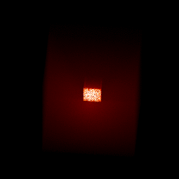

.. _animations:

=================
Making animations
=================

In this tutorial, we will find out how to make animations from Hyperion output.

Example model
=============

To start with we will use a model very similar to :doc:`tutorial_images` but
this time we only compute the image in one wavelength bin, but for a number of
different viewing angles:

.. literalinclude:: scripts/flyaround_cube_setup.py
   :language: python

.. note:: If you want to run this model you will need to download
          the :download:`kmh_lite.hdf5 <scripts/kmh_lite.hdf5>` dust file into the
          same directory as the script above (**disclaimer**: do not use this
          dust file outside of these tutorials!).

Making a fly-around movie
=========================

The following script describes how to generate PNG frames for an animation:

.. literalinclude:: scripts/flyaround_cube_animate.py
   :language: python

The frames can then be combined into a GIF animation using ImageMagick::

    $ convert -delay 10 -adjoin frames/*.png movie.gif

The delay value is the delay between frames in 1/100ths of a second. The result
is the following:

