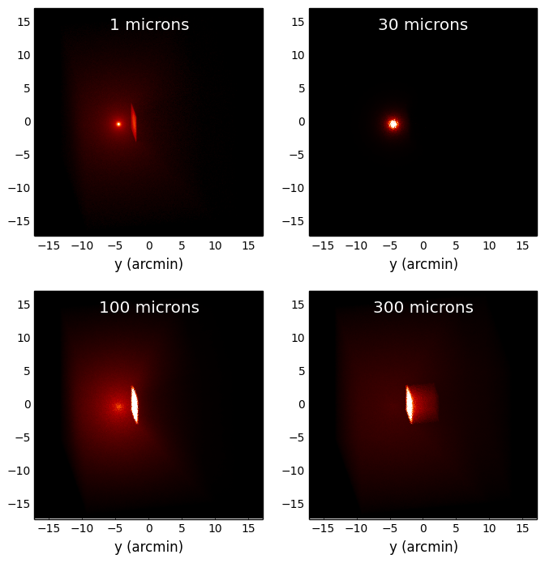
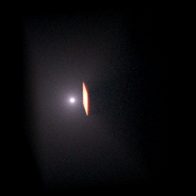

===========================
Plotting and writing images
===========================

.. _Numpy: http://numpy.scipy.org/
.. _Astropy: http://www.astropy.org

As mentioned in :doc:`tutorial_seds`, the output files from the radiative
transfer code are in the HDF5 file format, and can therefore be accessed
directly from most programming/scripting languages. However, in most cases it
is easiest to use the Hyperion Python library to extract the required
information and write it out to files. In this tutorial, we learn how to write
out images to FITS files (for an example of writing out SEDs, see
:doc:`tutorial_seds`).

Example model
=============

In this example, we set up a simple model that consists of a cube of constant
density, with a point source shining isotropically. A denser cube then causes
some of the emission to be blocked, and casts a shadow:

.. literalinclude:: scripts/simple_cube_setup.py
   :language: python

.. note:: If you want to run this model you will need to download
          the :download:`kmh_lite.hdf5 <scripts/kmh_lite.hdf5>` dust file into the
          same directory as the script above (**disclaimer**: do not use this
          dust file outside of these tutorials!).

Plotting images
===============

.. note:: If you have never used Matplotlib before, you can first take a look
          at the :doc:`python_matplotlib` tutorial.

The first step is to extract the image cube from the output file
(``simple_cube.rtout``). This step is described in detail in
:ref:`post-processing`. We can make a plot of the surface brightness

.. literalinclude:: scripts/simple_cube_plot.py
   :language: python

This script produces the following plot:

Writing out images
==================

Writing out images to text files does not make much sense, so in this section
we see how to write out images extracted from the radiative transfer code
results to a FITS file, and add WCS information. Once a 2D image or 3D
wavelength cube have been extracted as shown in `Plotting images`_, we can
write them out to a FITS file using `Astropy`_:

.. literalinclude:: scripts/simple_cube_write.py
   :language: python

Writing out images with WCS information
=======================================

Adding World Coordinate System (WCS) information is easy using
`Astropy`_:

.. literalinclude:: scripts/simple_cube_write_wcs.py
   :language: python

Making 3-color images
=====================

Making 3-color images is possible using the `Python Imaging Library
<http://www.pythonware.com/products/pil/>`_. The following example demonstrates
how to produce a 3-color PNG of the above model using the scattered light
wavelengths:

.. literalinclude:: scripts/simple_cube_rgb.py
   :language: python

which gives:

Alternatively, you can write out the required images to FITS format, then use
the `make_rgb_image function in APLpy
<http://aplpy.readthedocs.org/en/v0.9.9/howto_rgb.html>`_ to make the 3-color
images.
