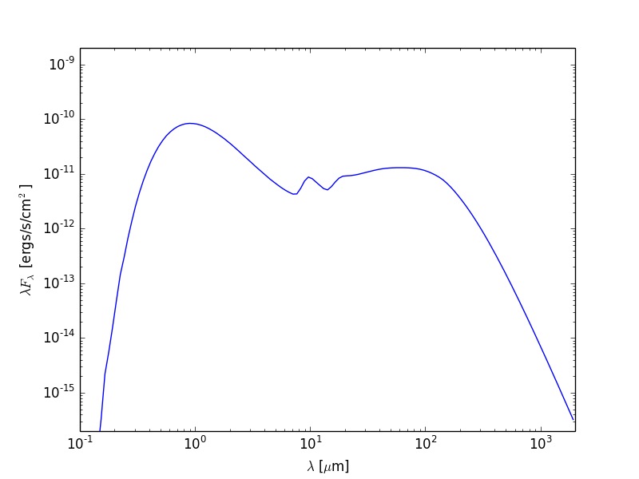
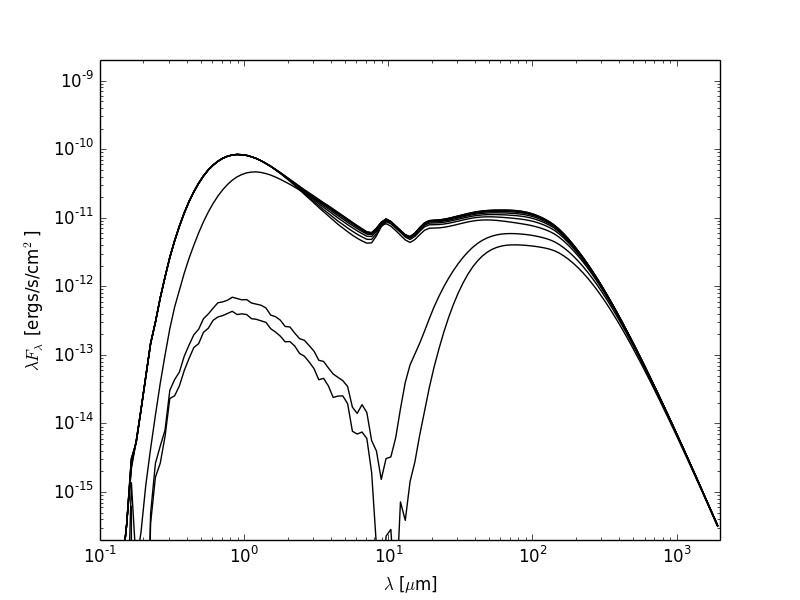
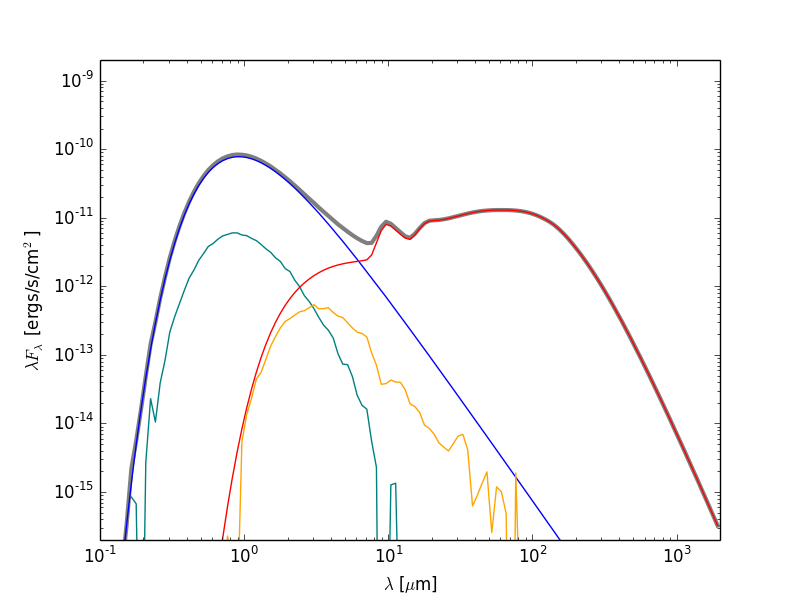

=============
Plotting SEDs
=============

.. _Matplotlib: http://matplotlib.org

So you've run a model with SEDs and/or images and you now want to plot
them. You now want to make plots of these from Python. The plotting
library used in this tutorial is `Matplotlib`_ but there is no reason why you
can't use another. The examples below get you to write Python scripts,
but you can also run these interactively in python or ipython if you
like.

.. note:: If you have never used Matplotlib before, you can first take a look
          at the :doc:`python_matplotlib` tutorial.

Example model
=============

As an example, let's set up a simple model of a star with a blackbody spectrum
surrounded by a flared disk using the
:class:`~hyperion.model.AnalyticalYSOModel` class.

.. literalinclude:: scripts/class2_sed_setup.py
   :language: python
   
If you want to run this model you will need to download the
:download:`kmh_lite.hdf5 <kmh_lite.hdf5>` dust file into the same directory as
the script above (**disclaimer**: do not use this dust file outside of these
tutorials!).

Note that the subsequent plotting code applies to any model, not just
:class:`~hyperion.model.AnalyticalYSOModel` models.

Plotting total flux SEDs
========================

Once the above model has run, we are ready to make a simple SED plot. The first
step is to extract the SED from the output file from the radiation transfer
code. This step is described in detail in :ref:`post-processing`. Combining
this with what we learned above about making plots, we can write scripts that
will fetch SEDs and plot them. For example, if we want to plot an SED for the
first inclination and the largest aperture, we can do:

.. literalinclude:: scripts/class2_sed_plot_single.py
   :language: python

This script produces the following plot:

Now let's say that we want to plot the SED for all inclinations. We can either
call :meth:`~hyperion.model.ModelOutput.get_sed` and loglog once for each
inclination, or call it once with ``inclination='all'`` and then call only
loglog once for each inclination:

.. literalinclude:: scripts/class2_sed_plot_incl.py
   :language: python

This script produces the following plot:

Plotting individual SED components
==================================

Now let's do something a little more fancy. Assuming that you set up the SEDs with photon tracking::

    sed.set_track_origin('basic')

or::

    sed.set_track_origin('detailed')

you can plot the individual components. Notice that we included the former in the model at the top of this page, so we can make use of it here to plot separate components of the SED.

The following example retrieves each separate components, and plots it in a different color:

.. literalinclude:: scripts/class2_sed_plot_components.py
   :language: python

This script produces the following plot:

