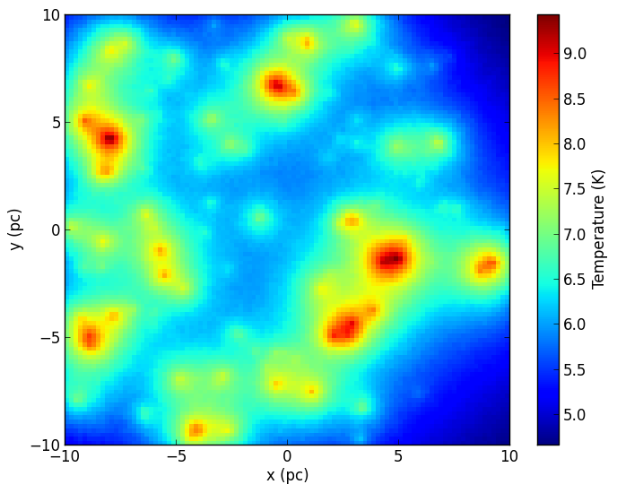
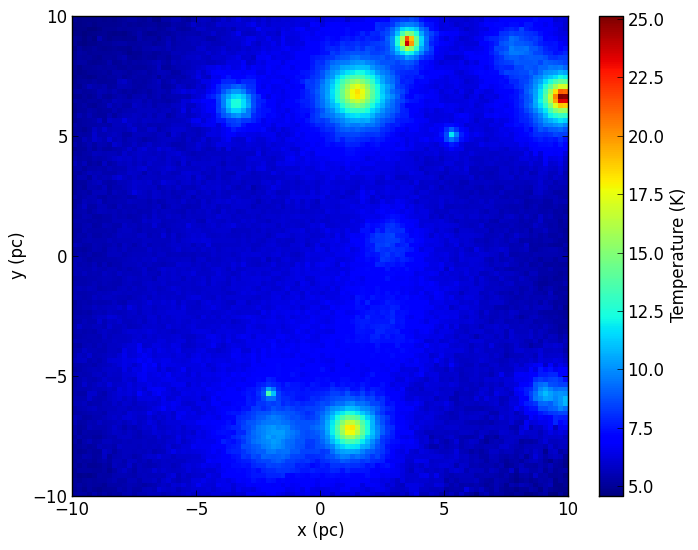
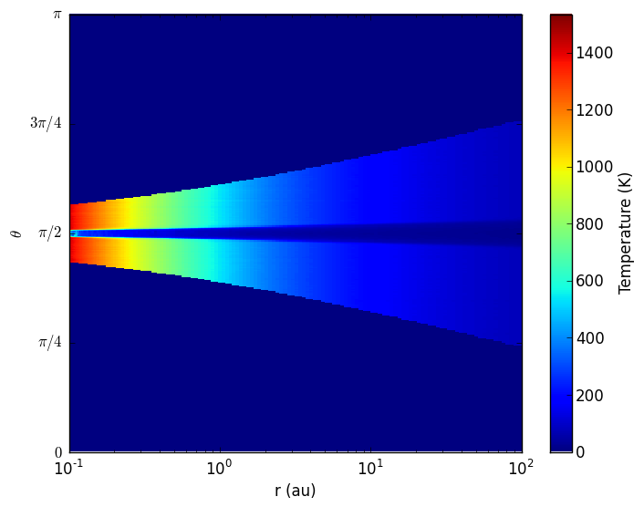
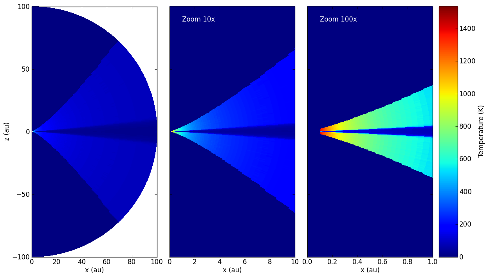

Visualizing physical quantities for regular 3-d grids
=====================================================

As described in :doc:`../postprocessing/extracting_quantities`, it is easy
to extract quantities such as density, specific_energy, and temperature from
the output model files. In this tutorial, we see how to visualize this
information efficiently.

Cartesian grid example
----------------------

We first set up a model of a box containing 100 sources heating up dust:

.. literalinclude:: scripts/quantity_cartesian_setup.py
   :language: python

.. note:: If you want to run this model you will need to download
          the :download:`kmh_lite.hdf5 <scripts/kmh_lite.hdf5>` dust file into the
          same directory as the script above (**disclaimer**: do not use this
          dust file outside of these tutorials!).

We can then use the ``get_quantities`` method described above to produce a
density-weighted temperature map collapsed in the z direction:

.. literalinclude:: scripts/quantity_cartesian_viz.py
   :language: python
   :end-before: # show image

Of course, we can also plot individual slices:

.. literalinclude:: scripts/quantity_cartesian_viz.py
   :language: python
   :start-after: # show image

Spherical polar grid example
----------------------------

Polar grids are another interest case, because one might want to plot the result in polar or cartesian coordinates. To demonstrate this, we set up a simple example with a star surrounded by a flared disk:

.. literalinclude:: scripts/quantity_spherical_setup.py
   :language: python

.. note:: If you want to run this model you will need to download
          the :download:`kmh_lite.hdf5 <scripts/kmh_lite.hdf5>` dust file into the
          same directory as the script above (**disclaimer**: do not use this
          dust file outside of these tutorials!).

Making a plot of temperature in (r, theta) space is similar to before:

.. literalinclude:: scripts/quantity_spherical_viz.py
   :language: python
   :end-before: # show image

Making a plot in spherical coordinates instead is in fact also straightforward:

.. literalinclude:: scripts/quantity_spherical_viz.py
   :language: python
   :start-after: # show image

