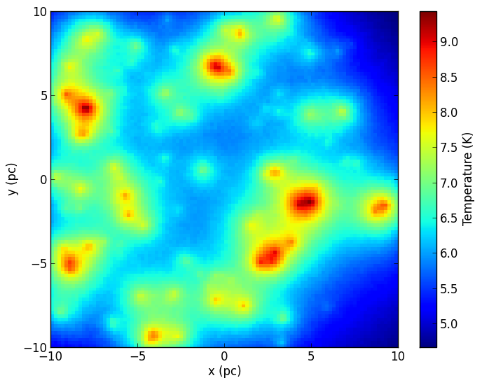
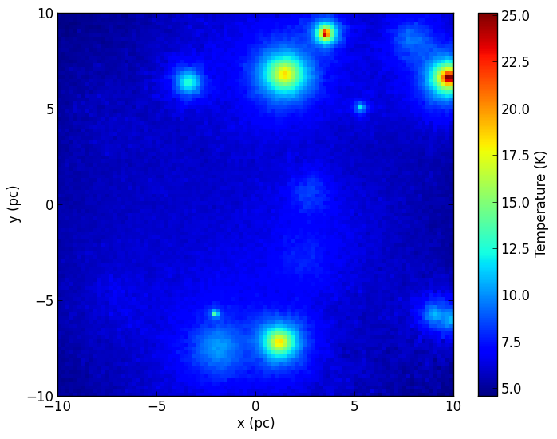

Visualizing physical quantities for regular 3-d grids
=====================================================

As described in :doc:`../postprocessing/extracting_quantities`, it is easy
to extract quantities such as density, specific_energy, and temperature from
the output model files. In this tutorial, we see how to visualize this
information efficiently.

Cartesian grid example
----------------------

We first set up a model of a box containing 100 sources heating up dust::

    import random
    random.seed('hyperion')  # ensure that random numbers are the same every time

    import numpy as np
    from hyperion.model import Model
    from hyperion.util.constants import pc, lsun

    # Define cell walls
    x = np.linspace(-10., 10., 101) * pc
    y = np.linspace(-10., 10., 101) * pc
    z = np.linspace(-10., 10., 101) * pc

    # Initialize model and set up density grid
    m = Model('example_cartesian')
    m.set_cartesian_grid(x, y, z)
    m.add_density_grid(np.ones((100, 100, 100)) * 1.e-20, 'kmh.hdf5')

    # Generate random sources
    for i in range(100):
        s = m.add_point_source()
        xs = random.uniform(-10., 10.) * pc
        ys = random.uniform(-10., 10.) * pc
        zs = random.uniform(-10., 10.) * pc
        s.position = (xs, ys, zs)
        s.luminosity = 10. ** random.uniform(0., 3.) * lsun
        s.temperature = random.uniform(3000., 8000.)

    # Specify that the specific energy and density are needed
    m.conf.output.output_specific_energy = 'last'
    m.conf.output.output_density = 'last'

    # Set the number of photons
    m.set_n_photons(initial=10000000, imaging=0)

    # Write output and run model
    m.write()
    m.run()

We can then use the ``get_quantities`` method described above to produce a
density-weighted temperature map collapsed in the z direction::

    import numpy as np
    import matplotlib.pyplot as plt

    from hyperion.model import ModelOutput
    from hyperion.util.constants import pc

    # Read in the model
    m = ModelOutput('example.rtout')

    # Extract the quantities
    g = m.get_quantities()

    # Get the wall positions in pc
    xw, yw = g.x_wall / pc, g.y_wall / pc

    # Make a 2-d grid of the wall positions (used by pcolormesh)
    X, Y = np.meshgrid(xw, yw)

    # Calculate the density-weighted temperature
    weighted_temperature =  np.sum(g['temperature'][0].array \
                                   * g['density'][0].array, axis=2)\
                            / np.sum(g['density'][0].array, axis=2)

    # Make the plot
    fig = plt.figure()
    ax = fig.add_subplot(1,1,1)
    c = ax.pcolormesh(X, Y, weighted_temperature)
    ax.set_xlim(xw[0], xw[-1])
    ax.set_xlim(yw[0], yw[-1])
    ax.set_xlabel('x (pc)')
    ax.set_ylabel('y (pc)')
    cb = fig.colorbar(c)
    cb.set_label('Temperature (K)')
    fig.savefig('weighted_temperature_cartesian.png', bbox_inches='tight')

Of course, we can also plot individual slices::

    fig = plt.figure()
    ax = fig.add_subplot(1,1,1)
    c = ax.pcolormesh(X, Y, g['temperature'][0].array[:, 49, :])
    ax.set_xlim(xw[0], xw[-1])
    ax.set_xlim(yw[0], yw[-1])
    ax.set_xlabel('x (pc)')
    ax.set_ylabel('y (pc)')
    cb = fig.colorbar(c)
    cb.set_label('Temperature (K)')
    fig.savefig('sliced_temperature_cartesian.png', bbox_inches='tight')

