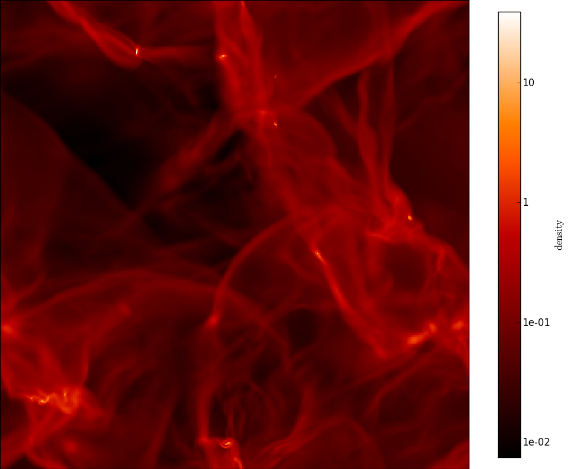
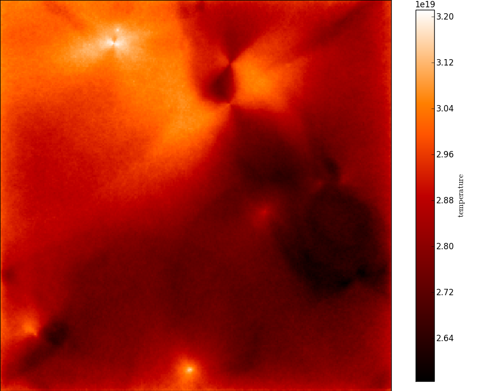

Visualizing physical quantities from adaptive grids with yt
===========================================================

As described in :doc:`../postprocessing/extracting_quantities`, it is
easy to extract quantities such as density, specific_energy, and
temperature from the output model files. In this tutorial, we see how to
visualize this information efficiently for AMR and Octree grids.

Fortunately, we can just make use of the excellent `yt
<http://yt-project.org/>`_ package that has been developed for that purpose!
Hyperion includes convenience methods to convert grid objects to objects that
you can use in yt.

If you extract quantities from an output file with::

    grid = m.get_quantities()

then ``grid`` will be an ``AMRGrid`` or ``OctreeGrid`` grid object. This
object contains all the information about the grid geometry, as well as the
physical quantities such as density, temperature, and specific energy
(depending on how you configured the model). You can then simply do::

    pf = grid.to_yt()

where ``pf`` is a ``StaticOutput`` yt object! This can then be used as a
normal dataset in yt. For example, we can easily make projections of density
and temperature along the y-axis::

    from yt import ProjectionPlot

    prj = ProjectionPlot(pf, 'y', ['density', 'temperature'], 
                         center=[0.0, 0.0, 0.0])
    prj.set_cmap('temperature', 'gist_heat')
    prj.set_cmap('density', 'gist_heat')
    prj.set_log('density', True)
    prj.save()

The ``to_yt`` method is also available for regular cartesian grids, but not
for the spherical or cylindrical polar grids.

.. note:: At the moment, the method used to plot Octrees is very
          inefficient, so plotting these will be very slow.

Projection plots are just a very small fraction of the functionality of yt -
you should have a careful look at their `documentation
<http://yt-project.org/doc/index.html>`_ to find out about all the available
functionality!

If we apply this to the output for the radiative transfer model on the
hydrodynamical simulation in `Robitaille (2011)
<http://dx.doi.org/10.1051/0004-6361/201117150>`_, the density looks like:

and the temperature looks like:

