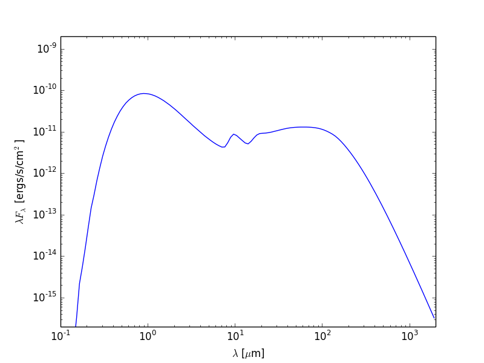
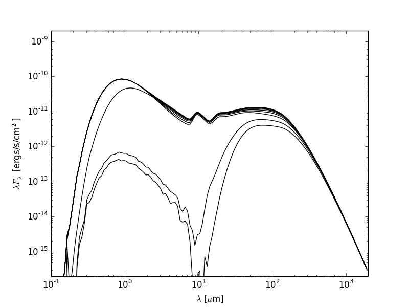
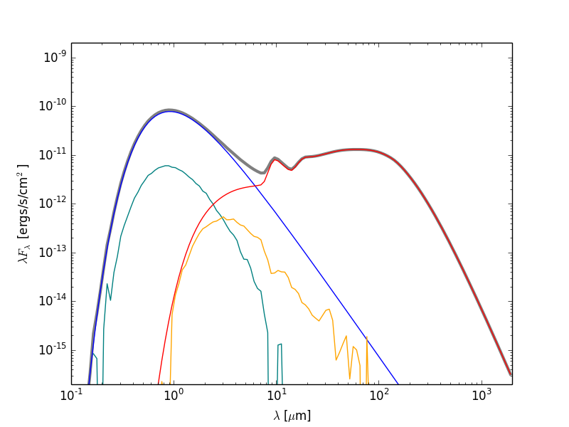

=============================
Plotting and writing out SEDs
=============================

.. _Matplotlib: http://matplotlib.org

So you've run a model with SEDs, and you now want to plot them or write the out
to files. The plotting library used in this tutorial is `Matplotlib`_ but there
is no reason why you can't use another. The examples below get you to write
Python scripts, but you can also run these interactively in python or ipython
if you like.

Example model
=============

As an example, let's set up a simple model of a star with a blackbody spectrum
surrounded by a flared disk using the
:class:`~hyperion.model.AnalyticalYSOModel` class.

.. literalinclude:: scripts/class2_sed_setup.py
   :language: python
   
.. note:: If you want to run this model you will need to download
          the :download:`kmh_lite.hdf5 <scripts/kmh_lite.hdf5>` dust file into the
          same directory as the script above (**disclaimer**: do not use this
          dust file outside of these tutorials!).

Note that the subsequent plotting code applies to any model, not just
:class:`~hyperion.model.AnalyticalYSOModel` models.

Plotting SEDs
=============

.. note:: If you have never used Matplotlib before, you can first take a look
          at the :doc:`python_matplotlib` tutorial.

Total flux
----------

Once the above model has run, we are ready to make a simple SED plot. The first
step is to extract the SED from the output file from the radiation transfer
code. This step is described in detail in :ref:`post-processing`. Combining
this with what we learned above about making plots, we can write scripts that
will fetch SEDs and plot them. For example, if we want to plot an SED for the
first inclination and the largest aperture, we can do:

.. literalinclude:: scripts/class2_sed_plot_single.py
   :language: python

This script produces the following plot:

Now let's say that we want to plot the SED for all inclinations. We can either
call :meth:`~hyperion.model.ModelOutput.get_sed` and loglog once for each
inclination, or call it once with ``inclination='all'`` and then call only
loglog once for each inclination:

.. literalinclude:: scripts/class2_sed_plot_incl.py
   :language: python

This script produces the following plot:

Individual SED components
-------------------------

Now let's do something a little more fancy. Assuming that you set up the SEDs
with photon tracking::

    sed.set_track_origin('basic')

or::

    sed.set_track_origin('detailed')

you can plot the individual components. Notice that we included the former in
the model at the top of this page, so we can make use of it here to plot
separate components of the SED.

The following example retrieves each separate components, and plots it in a
different color:

.. literalinclude:: scripts/class2_sed_plot_components.py
   :language: python

This script produces the following plot:

   
Writing out SEDs
================

.. note:: If you have never written text files from Python before, you can 
          first take a look at the :doc:`python_writing` tutorial.

The output files from the radiative transfer code are in the HDF5 file format,
and can therefore be accessed directly from most programming/scripting
languages. However, in many cases it might be most convenient to write a small
Python script to extract the required information and to write it out to files
that can then be read in to other tools.

For instance, you may want to write out the SEDs to ASCII files. To do this,
the first step, as for plotting (see `Plotting SEDs`_ above) is to extract the
SED from the output file from the radiation transfer code. This step is also
described in detail in :ref:`post-processing`. Once we have extracted an SED we
can write a script that will write it out to disk. For example, if we want to
write out the SED for the first inclination and the largest aperture from the
`Example Model`_, we can do:

.. literalinclude:: scripts/class2_sed_write.py
   :language: python

This script produces a file that looks like:

.. literalinclude:: scripts/sed.txt
    :lines: 1-8
    :append: ...
    
